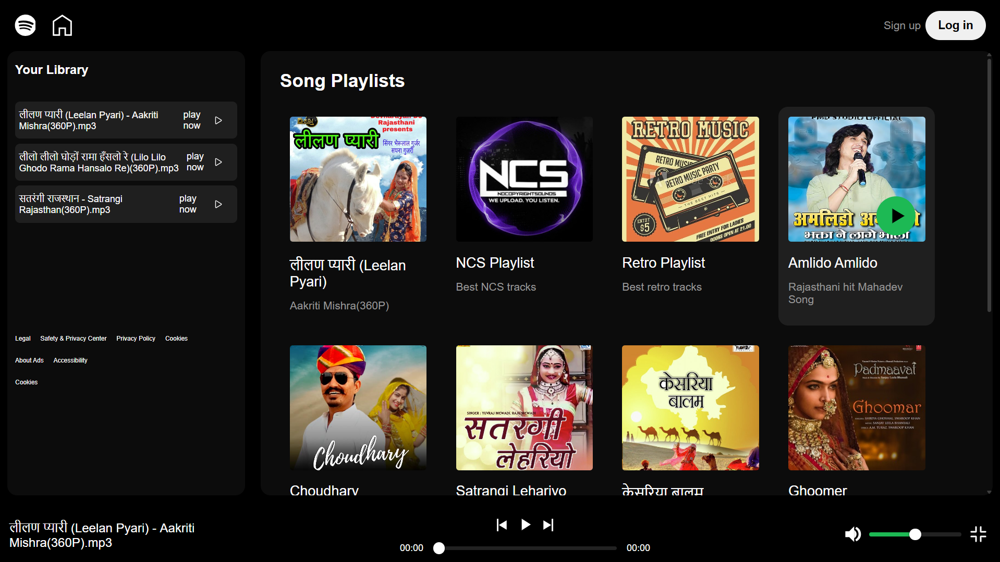

# 🎵 Spotify Front-End Clone

This is a **Spotify-like music player front-end** built using **HTML, CSS, and JavaScript**, where users can **dynamically add and play songs from their local device** — without needing any backend or server.

---

## 🚀 Features

- 🎧 **Play Music Directly from Your Device**  
  Select audio files from your computer and play them using the in-browser audio player.

- 📂 **Dynamic Song List**  
  Songs are automatically listed when added — no manual coding required.

- 💡 **Pure Front-End (No Backend Needed)**  
  Everything is handled on the client side. Your audio files never leave your computer.

- 🎨 **Clean and Minimal UI**  
  Simple and familiar layout, inspired by Spotify's interface.

---

## 📸 Preview

  

---

## 🛠️ Tech Stack

- **HTML** – Page structure
- **CSS** – Styling and layout
- **JavaScript** – Dynamic functionality (file handling, playback)

---

## 📂 How It Works

1. The user clicks the file input and selects one or more audio files.
2. JavaScript dynamically lists the selected songs on the page.
3. Clicking on a song item creates a local URL and plays it using the browser's `<audio>` element.
4. No upload or server interaction takes place — it’s fully client-side.

---

## 📦 Setup Instructions

1. **Clone this repository**:
   ```bash
   git clone https://github.com/Dileep-kumawat/spotify-front-end-.git
